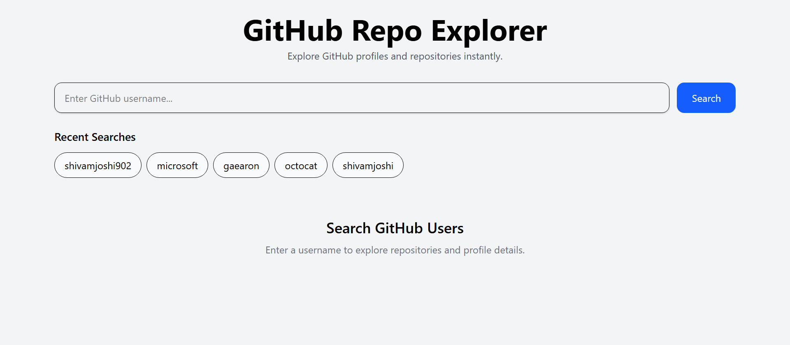
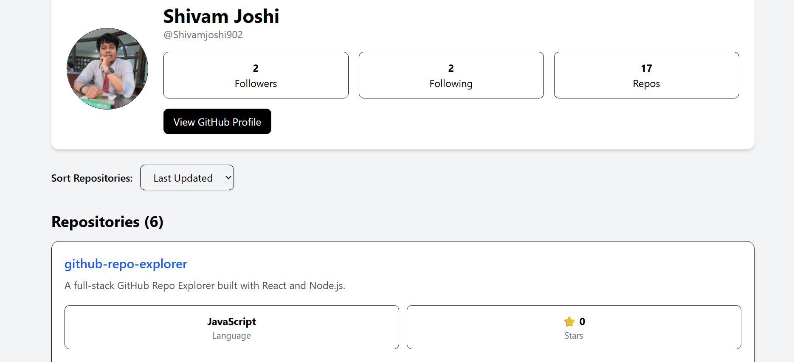
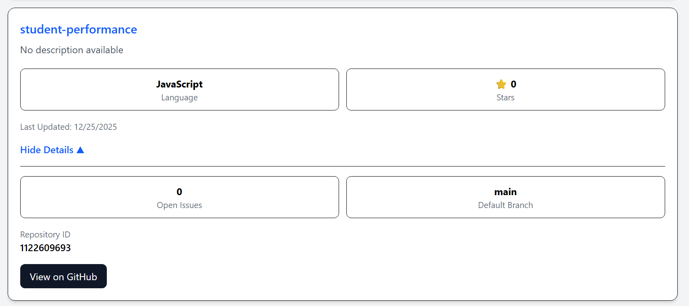
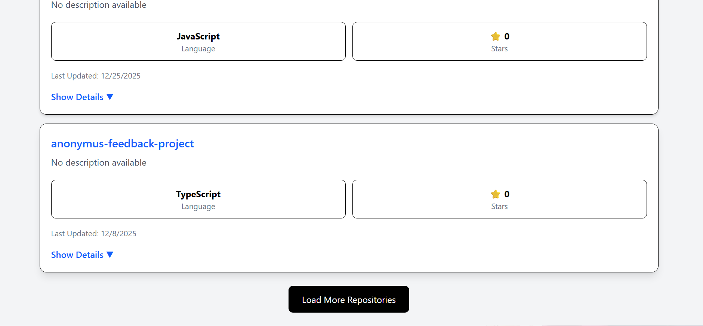

# GitHub Repo Explorer

A full-stack GitHub Repository Explorer built with React, Node.js, and Express that allows users to search GitHub profiles, explore repositories, sort results, view repository details, and analyze public GitHub data through a clean and responsive interface.

## Live Demo

### Frontend

github-repo-explorer-amber-one.vercel.app

### Backend API

https://github-repo-explorer-api-mzh1.onrender.com

---

## Features

### User Search

* Search any public GitHub user
* Fetch profile information in real time
* Display avatar, name, bio, followers, following, and repository count

### Repository Explorer

* View all public repositories
* Repository name and description
* Programming language
* Star count
* Last updated date

### Repository Sorting

* Sort repositories by:

  * Name
  * Stars
  * Last Updated

### Expandable Repository Details

* Open Issues count
* Default Branch
* Repository ID
* Direct link to GitHub repository

### Load More Pagination

* Initial repository limit
* Incremental loading of repositories
* Improved user experience for accounts with many repositories

### Recent Searches

* Stores recent searches using Local Storage
* Quick access to previously searched users

### Loading & Error Handling

* Loading state while fetching data
* Invalid username handling
* Network error handling
* GitHub API rate limit handling
* Toast notifications for success and error states

### Backend Optimization

* 60-second in-memory caching
* Reduced GitHub API calls
* Faster repeated searches

---

## Screenshots

### Home Page



### Search Results



### Expanded Repository Details



### Load More Feature



---

## Tech Stack

### Frontend

* React 19
* Vite
* Tailwind CSS
* Axios
* React Hot Toast

### Backend

* Node.js
* Express.js
* Axios
* dotenv

### Deployment

* Vercel (Frontend)
* Render (Backend)

---

## Architecture

Frontend communicates with the backend API.

The backend acts as a proxy between the frontend and GitHub REST API while providing caching and error handling.

```text
React Frontend
      |
      v
Express Backend
      |
      v
GitHub REST API
      |
      v
In-Memory Cache
```

---

## Project Structure

```text
github-repo-explorer
│
├── client
│   ├── src
│   │   ├── components
│   │   ├── services
│   │   ├── App.jsx
│   │   └── main.jsx
│   │
│   └── package.json
│
├── server
│   ├── src
│   │   ├── cache
│   │   ├── controllers
│   │   ├── routes
│   │   ├── services
│   │   └── app.js
│   │
│   ├── server.js
│   └── package.json
│
└── README.md
```

---

## API Endpoints

### Get GitHub User Information

```http
GET /api/users/:username
```

Example:

```http
GET /api/users/octocat
```

Response:

```json
{
  "success": true,
  "user": {},
  "repos": []
}
```

---

## Environment Variables

### Backend (.env)

```env
PORT=5000
GITHUB_TOKEN=<YOUR_GITHUB_PERSONAL_ACCESS_TOKEN>
```

A GitHub Personal Access Token is required to increase GitHub API rate limits and avoid unauthenticated request restrictions.

### Frontend (.env)

```env
VITE_API_URL=http://localhost:5000/api
```

---

## Local Setup

### Clone Repository

```bash
git clone https://github.com/Shivamjoshi902/github-repo-explorer.git
```

### Backend Setup

```bash
cd server
npm install
npm start
```

### Frontend Setup

```bash
cd client
npm install
npm run dev
```

---

## Performance Optimizations

### Server-Side Caching

GitHub API responses are cached for 60 seconds using an in-memory cache.

Benefits:

* Reduced GitHub API requests
* Faster repeated searches
* Improved responsiveness

### GitHub API Authentication

Uses a GitHub Personal Access Token to:

* Increase API rate limits
* Improve reliability
* Avoid frequent rate limit issues

---

## Error Handling

The application handles:

* Invalid GitHub usernames
* GitHub API failures
* Network connectivity issues
* GitHub API rate limits
* Unexpected server errors

---

## Assumptions & Tradeoffs

### Assumptions

* Users search only public GitHub profiles.
* Repository data is retrieved from GitHub's public API.

### Tradeoffs

* In-memory cache was chosen for simplicity and assignment scope.
* Cache resets on server restart.
* Pagination is implemented on the client side after repository retrieval.

For a production-scale application, Redis would be a better caching solution.

---

## Future Improvements

* Language distribution chart
* Debounced search
* Advanced repository filtering
* Dark mode
* Unit and integration tests
* Redis-based distributed caching
* Repository analytics dashboard

---

## Assignment Requirements Coverage

### Must Have

* User Search
* Profile Information
* Repository Listing
* Repository Sorting
* Error Handling

### Should Have

* Server-side Caching
* Loading States
* Load More Pagination
* Expandable Repository Details
* Network Error Handling

### Nice To Have

* Recent Searches (Implemented)
* Local Storage Persistence (Implemented)

---

## Author

Shivam Joshi

GitHub: https://github.com/Shivamjoshi902
